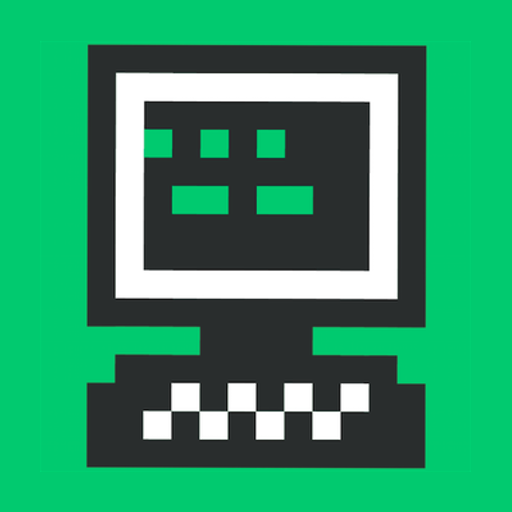

# Recurse Roulette App

The site (recurse.roulette.com) works best in Chrome, but if you'd rather not do that you can use the Electron-based desktop app instead:

## macOS
  - [https://teambeard.s3.amazonaws.com/recurse-roulette-1.0.0.dmg](https://teambeard.s3.amazonaws.com/recurse-roulette-1.0.0.dmg)

## Windows
  - [https://teambeard.s3.amazonaws.com/recurse-roulette-setup-1.0.0.exe](https://teambeard.s3.amazonaws.com/recurse-roulette-setup-1.0.0.exe)
  
## Linux
  - [https://teambeard.s3.amazonaws.com/recurse-roulette-1.0.0.AppImage](https://teambeard.s3.amazonaws.com/recurse-roulette-1.0.0.AppImage)
  - [https://teambeard.s3.amazonaws.com/recurse-roulette-desktop-app_1.0.0_amd64.snap](https://teambeard.s3.amazonaws.com/recurse-roulette-desktop-app_1.0.0_amd64.snap)

# Build Yourself

To build for all platforms run:  
`npm run build`

For macOS:  
`npm run build:mac`

For Windows:  
`npm run build:win`

If you're not using Windows you'll need to install [Wine](https://www.winehq.org/) to build the Windows executables.

For Linux:  
`npm run build:linux`
